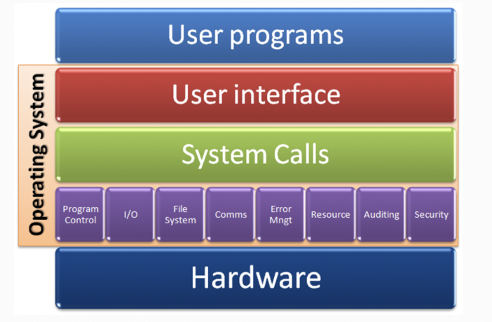
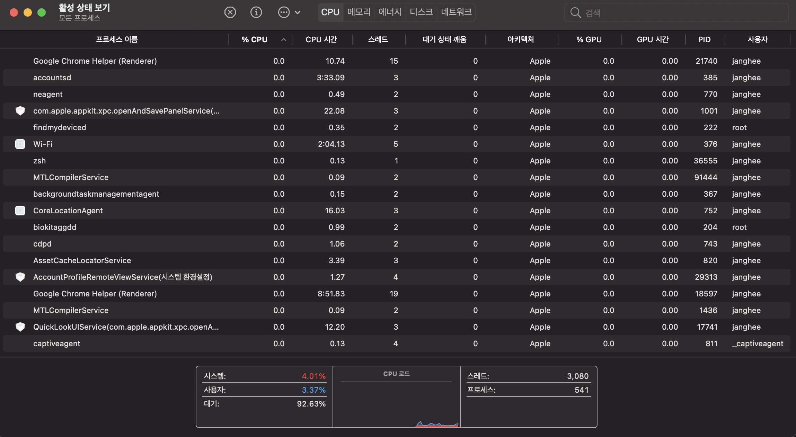
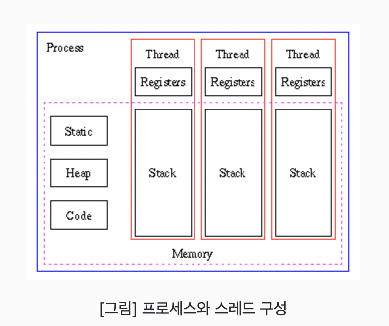
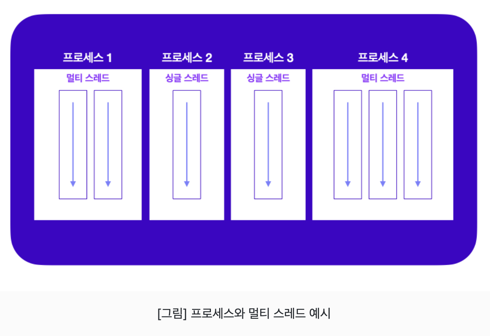
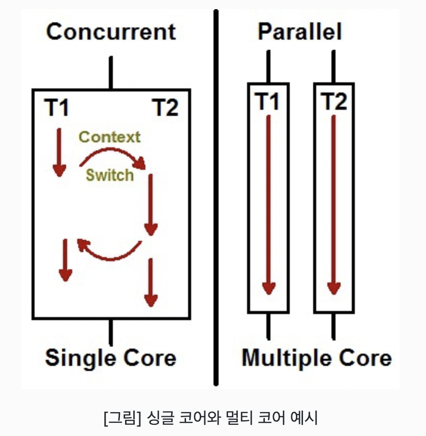

## Https 프로토콜

https는 http 요청을 SSL혹은 TLS라는 알고리즘을 이용해 HTTP통신을 하는 과정에서 내용을 암호화하여 데이터를 전송하는 방법입니다. https는 http보다 상대적으로 안전한 방법이고, 데이터 제공자의 신원을 보장받을 수 있습니다.

<br />

## 암호화

HTTPS 프로토콜의 특징 중 하나는 암호화된 데이터를 주고 받기 때문에, 중간에 인터넷 요청이 탈취되더라도 복호화 하기 전까지는 그 내용을 알아볼 수 없습니다.

<br />

## 인증서

https 프로토콜의 또 다른 특징 중 하나는 브라우저가 응답과 함께 전달된 인증서 정보를 확인할 수 있습니다. 브라우저는 인증서에 해당 인증서를 발급한 CA 정보를 확인하고 인증된 CA가 발급한 인증서가 아니라면 경고창을 띄워 서버 연결이 안전하지 않다고 화면에 보여줍니다.

<br />

---

## HTTPS 사설 인증서 발급

moaOS 경우, homebrew통해 mkcert를 설치할 수 있습니다.

```js
$ brew i mkcert
$ brew i nss //firefox를 사용할 경우 이거 설치
```

## 인증서 생성

아래 명령어로 로컬을 인증된 발급기관으로 추가합니다.

```js
$ mkcert -i
```

아래코드는 로컬 환경에 대한 인증서를 만드는 코드입니다.

```js
$ mkcert -key-file key.pem -cert-file cert.pem localhost 127.0.0.1 ::1
```

위코드를 통해 `cert.pem`, `key.pem` 이라는 파일이 생성이 된 것을 확인할수 있습니다. `key.pem`의 경우 개인 키이므로 git 커밋이 아닌 환경변수를 활용해 암호처럼 다뤄야 합니다.

<br />


## https 서버 기본 구현 코드

```js
const https = require('https');
const fs = require('fs');
const express = require('express');

const app = express();

https
  .createServer(
    {
      key: fs.readFileSync(__dirname + '/key.pem', 'utf-8'),
      cert: fs.readFileSync(__dirname + '/cert.pem', 'utf-8'),
    },
    app.use('/', (req, res) => {
      res.send('Congrats! You made https server now :)');
    })
  )
  .listen(3001);
  ```

  ---

  ## cookie

쿠키는 서버에서 클라이언트에 데이터를 저장하는 하나의 방법입니다. 서버가 원한다면 서버는 클라이언트에서 쿠키를 이용하여 데이터를 가져올 수 있습니다. 단순히 서버에서 클라이언트에 쿠키를 전송하는 것만 의미하지 않고 클라이언트에서 서버로 쿠키를 전송하는 것도 포합됩니다.<br >

### 서버가 클라이언트에 데이터를 저장할 수 있습니다.

무조건 데이터를 저장한 이후 아무 떄나 데이터를 가져올 수 없습니다. 데이터를 저장한 이후 특정 조건들이 만족하는 경우메나 다시 가져올 수 있습니다. 이러한 조건들은 쿠키 옵션으로 표현할수 있습니다.

<br />

## 쿠키 옵션

### 1. Domain

도메인은 쉽게 말해 `www.naver.com`과 같은 서버에 접속할 수 있는 이름입니다. 쿠키옵션에서의 도메인은 포트, 세부 경로, 정보 및 서브 도메인을 포함하지 않습니다. 서브도메인인 `www.`가 빠진 `naver.com`이 됩니다. 만약 쿠키 옵션에서 도메인 정보가 존재한다면 클라이언트에서는 쿠키의 도메인 옵션과 서버의 도메인이 일치해야만 쿠키를 전송할 수 있습니다.

<br />

### 2. Path

서버가 라우팅할 때 사용하는 경로입니다. 만약 요쳥해야할 URL이 `http://www.localhost.com/users.login`인 경우라면 Path, 세부 경로는 `/users/login`이 됩니다. 명시하지 않을경우 기본으로 `/`으로 설정 되어 있습니다. 쿠키를 전송하기 위해선 쿠키옵션의 Path와 요청 경로가 일치해야 가능합니다. <br />

```js
//쿠키전송 가능한 경우
/user           //Path옵션
// 요청경로
/user/login

//쿠키전송 불가능한 경우
/user           //Path옵션
// 요청경로
/users/login    // Path옵션을 만족하지 못해 쿠키 전송  x
```

<br />

## Secure

쿠키를 전송해야 할 때 사용하는 프로토콜에 따른 쿠키 전송 여부를 결정합니다. 만약 해당 옵션이 true로 설정된 경우, HTTPS 프로토콜을 이용하여 통신하는 경우에만 쿠키를 전송할 수 있습니다. (http는 secure속성으로 쿠키를 설정할수 없습니다.) 

<br />

## HttpOnly

자바스크립트에서 브라우저의 쿠키에 접근 여부를 결정합니다. 만약 해당 옵션이 true로 설정된 경우, 자바스크립트에서 쿠키에 접근이 불가합니다. 명시되지 않는 경우 기본으로 false로 지정되어 있습니다. (false인경우 쿠키 접근이 가능해 XSS공격에 취약)

<br />

## MaxAge or Expires

쿠키가 유효한 기간을 정하는 옵션입니다. MaxAge는 몇 초 동안 쿠키가 유효한지 설정하는 것이고 Expires는 클라이언트 기준으로 Date를 지정합니다. 시간 날짜를 초과하면 쿠키는 자동으로 파괴됩니다. 하지만 두옵션을 지정하지 않을 경우 브라우저의 탭을 닫아야만 쿠키가 제거될 수 있습니다.

<br />

## SameSite

Cross-Origin 요청을 받은 경우 요청에서 사용한 메소드와 해당 옵션의 조합으로 서버의 쿠키 전송 여부를 결정합니다.

### Lax

사이트가 서로 달라도, GET 요청이라면 쿠키 전송이 가능합니다.

### Strict

사이트가 서로 다르면, 쿠키 전송을 할 수 없으며 Cross-Origin이 아닌 same-site인 경우에만 쿠키를 전송 할수 있습니다.

### None
사이트가 달라도, 모든(GET, POST, PUT 등등) 요청에 대해 쿠키 전송이 가능하다. 다만 쿠키 옵션 중 Secure 옵션이 필요합니다.

<br />

이때 'same-site'는 요청을 보낸 Origin과 서버의 도메인이 같은 경우를 말합니다. 이러한 옵션들을 지정한 다음 서버에서 클라이언트로 쿠키를 처음 전송하게 된다면 헤더에 Set-Cookie라는 프로퍼티에 쿠키를 담아 쿠키를 전송하게 됩니다. 이후 클라이언트 혹은 서버에서 쿠키를 전송해야 한다면 클라이언트는 헤더에 Cookie라는 프로퍼티에 쿠키를 담아 서버에 쿠키를 전송하게 됩니다.

<br />

## cookie 설정 코드

express-session 라이브러리를 이용해 쿠키 설정을 해줄 수 있습니다.

```js
//...생략

app.use(
  session({
    secret: '@codestates',
    resave: false,
    saveUninitialized: true,

    // 쿠키 설정
    cookie: {
      domain: 'localhost',
      path: '/',
      maxAge: 24 * 6 * 60 * 10000,
      sameSite: 'None',
      httpOnly: true,
      secure: true,
    },
  })
);

//...생략
```

<br />

## 쿠키 옵션 Point 정리

domain - 서버와 요청의 도메인이 일치하는 경우 쿠키 전송  
path - 서버의 요청의 세부경로가 일치하는 경우 쿠키 전송  
maxage/expires - 쿠키의 유효기간 설정  
httpOnly - 스크립트의 쿠키 접근 가능 여부 설정  
secure - HTTPS 에서만 쿠키 전송 여부 설정  
sameSite - 같은 사이트에서만 쿠키를 사용할 수 있게 하는 설정  

---


# 문자열

그냥 읽고 이런게 있구나 하고 넘어갑시다!  

---

## 문자열 하나는 몇 바이트인가요?

영어의 경우 알파벳 하나가 1 바이트(byte)를 차지하는 시절이 있었습니다. 그러나 글로벌 시대에는 유니코드를 사용해야 텍스트를 정확하게 저장할 수 있습니다. 프로그래밍 언어마다 문자열을 저장하는 자료형이 다 다르므로, "문자열 하나가 몇 바이트인가?"에 대한 답변은 이 자료형이 차지하고 있는 바이트를 이해할 때 답변할 수 있습니다.

<br />

## 유니코드는 무엇인가요?

유니코드(Unicode)는 유니코드 협회(Unicode Consortium)가 제정하는 전 세계의 모든 문자를 컴퓨터에서 일관되게 표현하고 다룰 수 있도록 설계된 산업 표준입니다. 이 표준에는 ISO 10646 문자 집합, 문자 인코딩, 문자 정보 데이터베이스, 문자를 다루기 위한 알고리즘 등을 포함하고 있습니다.  

유니코드가 탄생하기 이전에는, 같은 한글이 적힌 텍스트 파일이라도 표현하는 방법이 제각각이었습니다. 어떤 파일이 지원하지 않는 다른 인코딩 형식으로 저장되어 있는 경우에는 파일을 제대로 불러올 수 없었습니다. 기본적으로 유니코드의 목적은 현존하는 문자 인코딩 방법을 모두 유니코드로 교체하는 겁니다.

<br />

### 인코딩(부호화)이란?

인코딩이란 어떤 문자나 기호를 컴퓨터가 이용할 수 있는 신호로 만드는 것입니다.  
이 신호를 입력하는 인코딩과 문자를 해독하는 디코딩을 하기 위해서는 미리 정해진 기준을 바탕으로 입력과 해독이 처리되어야 합니다.
이렇게 인코딩과 디코딩의 기준을 문자열 세트 또는 문자셋(charset)이라고 합니다. 이 문자셋의 국제 표준이 유니코드입니다.

<br />

## ASCII 문자는 무엇인가요?

영문 알파벳을 사용하는 대표적인 문자 인코딩으로 7 비트로 모든 영어 알파벳을 표현할 수 있습니다. 52개의 영문 알파벳 대소문자와, 10개의 숫자, 32개의 특수 문자, 그리고 하나의 공백 문자를 포함합니다.  

유니코드는 ASCII를 확장한 형태입니다.

<br />

## UTF-8과 UTF-16의 차이점은 무엇인가요?
UTF-8과 UTF-16은 인코딩 방식의 차이를 의미합니다. UTF-8은 Universal Coded Character Set + Transformation Format – 8-bit의 약자로, UTF- 뒤에 등장하는 숫자는 비트(bit)입니다.

<br />

### 1. UTF-8 특징: 가변 길이 인코딩
UTF-8은 유니코드 한 문자를 나타내기 위해 1 byte(= 8 bits) 에서 4 bytes까지 사용합니다.  

- 원리  

예를 들어, 코 라는 문자의 유니코드는 U+CF54 (16진수, HEX)로 표현됩니다. 이 문자를 이진법(binary number)으로 표시하면, 1100-1111-0101-0100 이 됩니다. 이 문자를 UTF-8로 표현하면, 다음과 같이 3byte 의 결과로 표현됩니다.

```js
// UTF-8로 표현된 '코'
1110xxxx 10xxxxxx 10xxxxxx # x 안에 순서대로 값을 채워넣습니다.
11101100 10111101 10010100

// '코'라는 문자를 UTF-8로 표현
let encoder = new TextEncoder(); // 기본 인코딩은 'utf-8'
encoder.encode('코') // Uint8Array(3) [236, 189, 148]

(236).toString(2) // "11101100"
(189).toString(2) // "10111101"
(148).toString(2) // "10010100"
```

ASCII 코드는 7비트로 표현되고, UTF-8 에서는 다음과 같이 1 byte의 결과로 만들 수 있습니다. 다음 예제는 b 라는 문자를 UTF-8로 인코딩한 결과입니다.

```js
// UTF-8로 표현된 'b'
0xxxxxxx
01100010 

// 'b'라는 문자를 UTF-8로 표현할 수 있습니다.
encoder.encode('b') // Uint8Array [98]
(98).toString(2) // "1100010"
```

<br />

이처럼, UTF-8은 1 byte에서 4 bytes까지의 가변 길이를 가지는 인코딩 방식입니다. 네트워크를 통해 전송되는 텍스트는 주로 UTF-8로 인코딩됩니다. 사용된 문자에 따라 더 작은 크기의 문자열을 표현할 수 있기 때문입니다. ASCII 문자는 1 바이트만으로 표현 가능한 것처럼 말입니다. UTF-8은 ASCII 코드의 경우 1 byte, 크게 영어 외 글자는 2byte, 3byte, 보조 글자는 4byte를 차지합니다. 이모지는 보조 글자에 해당하기 때문에 4byte가 필요합니다.

### 2. UTF-8 특징: 바이트 순서가 고정됨

UTF-16에 비해 바이트 순서를 따지지 않고, 순서가 정해져 있습니다.

<br />

### 3. UTF-16 특징: 코드 그대로 바이트로 표현 가능, 바이트 순서가 다양함

UTF-16은 유니코드 코드 대부분(U+0000부터 U+FFFF; BMP) 을 16 bits로 표현합니다.  

대부분에 속하지 않는 기타문자는 32 bit(4 bytes)로 표현하므로 UTF-16도 가변 길이라고 할 수 있으나, 대부분은 2 바이트로 표현합니다
U+ABCD라는 16진수를 있는 그대로 이진법으로 변환하면 1010-1011-1100-1101 입니다. 이 이진법으로 표현된 문자를 16 bits(2 bytes)로 그대로 사용하며, 바이트 순서(엔디언)에 따라 UTF-16의 종류도 달라집니다.  

UTF-8에서는 한글은 3 바이트, UTF-16에서는 2 바이트를 차지합니다.

<br />

---

## 비트맵(PNG)과 벡터(SVG) 이미지 차이

  |...|비트맵(Raster)|벡터(Vector)|
|:------:|:------:|:------:|
|기반 기술|픽셀 기반|수학적으로 계산된 Shape 기반|
|특징|사진과 같이 색상의 조합이 다양한 이미지에 적합|로고, 일러스트와 같이 제품에 적용되는 이미지에 적합|
|확대|확대에 적합하지 않음, 보다 큰 사이즈의 이미지가 필요할 때 사용하려는 크기 이상으로 생성하거나 스캔해야 함|품질 저하없이 모든 크기로 확대 가능하며, 해상도의 영향을 받지 않음|
|크기에 따른 파일 용량|큰 크기의 이미지는, 큰 파일 사이즈를 가짐|큰 크기의 벡터 그래픽은 작은 파일 사이즈를 유지할 수 있음|
|상호 변환|이미지의 복잡도에 따라 벡터로 변환하는 것에 오랜 시간이 걸림|쉽게 래스터 이미지로 변환 가능|
|확대|jpg, gif, png, bmp, psd|svg, ai|
|웹에서의 사용성|jpg, gif, png 등이 널리 쓰임|svg 포맷은 현대의 브라우저에서 대부분 지원|

---

# 운영체제

하드웨어에게 일을 시키는 주체가 바로 운영체제입니다. 또 한 하드웨어의 설계를 바탕으로 하드웨어에게 일을 시킵니다.

---

## 운영체제

### 시스템 자원관리

운영체제는 하드웨어에게 일을 시킬 수 있도록 도오줍니다. 하드웨어를 구성하는 일은 프로세스 관리(CPU), 메모리 관리, I/O(입출력)관리(디스크,네트워크 등)을 합니다. 이러한 시스템 자원을 관리하는 주체가 바로 운영체제 입니다.

<!--  -->
<p align="center"></p>

<br />

### 응용 프로그램 관리

시스템의 자원을 마음대로 사용한다면 헤커에 의한 공격에 무방비한 상태가 됩니다. 그래서 응용 프로그램은 권한에 대한 관리가 필요합니다. 그래서 응용 프로그램이 실행되고, 시스템 자원을 사용할 수 있도록 권한과 사용자를 관리합니다.

<br />

## 응용 프로그램 : 운영체제를 통해 컴퓨터에게 일을 시키는 것 (System call)

응용 프로그램이 운영체제를 통해 컴퓨터에게 일을 시키려면 권한을 운영체제로 부터 받아야 합니다. 응용 프로그램이 운영체제와 소통하기 위해서는, 운영체제가 으용 프로그램을 위해 인터페이스(API)를 제공해야 합니다. 이러한 시스템 자원을 사용할 수 있도록 다양한 함수를 제공하는 것을 시스템 콜(System call)이라고 합니다.  

예를들어 응용 프로그램이 프린터 사용에 대한 권한을 획득한 후에는, 프린터를 사용할 때 필요한 API를 호출해야 합니다. 이 API는 시스템 콜로 이뤄져 있습니다.

[참고자료](https://parksb.github.io/article/5.html)

<br />

---

# 프로세스, 스레드, 멀티 스레드

## 프로세스(Process)

사용자가 애플리케이션을 실행하면, 운영체제로 부터 실행에 필요한 메모리를 할당 받아 애플리케이션의 코드를 실행합니다. 이때 실행되는 애플리케이션을 프로세스라고 부릅니다.




<br />

## 스레드(Thread)

하나의 스레드는 코드가 실행되는 하나의 흐름이기 때문에, 한 프로세스 내에 스레드가 두 개라면 코드가 실행 되는 흐름이 두 개 생긴다라는 의미입니다. 

<br />

### 스레드 특징

1. 프로세스 내에서 실행되는 흐름의 단위
2. 각 스레드 마다 call stack이 존재(call stack : 실행중인 서브루틴을 저장하는 자료 구조)
3. 스레드는 다른 스레드와 독립적으로 동작

### 프로세스와 스레드 구성

<!--  -->
<p align="center"></p>

<br />

## 멀티 스레드(Multi-Thread)

멀티 태스킹은 두 가지 이상의 작업을 동시에 처리하는 것을 의미합니다. 운영체제는 멀티 태스킹을 할 수 있도록, 프로세스마다 CPU 및 메모리 자원을 적절히 할당하고 병렬로 실행합니다. 멀티 스레드는 다양한 곳에서 사용됩니다. 대용량 데이터의 처리시간을 줄이기 위해 데이터를 분할 하여 병렬로 처리하는 데에 사용할 수도 있고, UI를 가지고 있는 애플리케이션에서 네트워크 통신을 하기 위해 사용 할 수도 있습니다.  

여러 클라이언트의 요청을 처리하는 서버를 개발할 때에도 사용됩니다.

<!--  -->
<p align="center"></p>

<br />

### 멀티 스레딩의 장점

1. 동시에 처리하던 일을 스레드로 구현할 경우, 메모리 공간과 시스템 자원의 소모가 줄어듭니다.
2. 프로세스 간 통신 방법(IPC)에 비해 스레드 간의 통신 방법이 훨씬 간단하다.
3. 시스템의 처리량이 향상되고 자원 소모가 줄어들어 자연스럽게 프로그램의 응답 시간이 단축 됩니다.

<br />

### 멀티 스레딩의 문제점

1. 멀티 프로세스 기반으로 프로그래밍을 할 때에는 프로세스 간 공유하는 자원이 없습니다.
2. 서로 다른 스레드가 같은 데이터에 접근하고, 힙 영역을 공유하기 때문에 서로 다른 스레드가 서로 사용중인 변수나 자료구조에 접근하여 엉뚱한 값을 읽어오거나 수정하는 일이 방생할 수 있습니다.

<br />

## 동시성과 병령성의 차이

<!--  -->
<p align="center"></p>

동시에 돌릴 수 있는 스레드 수는 컴퓨터에 있는 코어 갯수로 제한됩니다. 운영체제(또는 가상 머신)는 각 스레드를 시간에 따라 분할하여, 여러 스레드가 일정 시간마다 돌아가면서 실행되도록 합니다. 이런 방식을 시분할이라고 합니다.  

- Concurrency(동시성, 병행성): 여러 개의 스레드가 시분할 방식으로 동시에 수행되는 것처럼 착각을 불러일으킴
- Parallelism(병렬성): 멀티 코어 환경에서 여러 개의 스레드가 실제로 동시에 수행됨

<br />

## Context Switching이란?

다른 태스크(프로세스, 스레드)가 시작할 수 있도록 이미 실행중인 태스크(프로세스, 스레드)를 멈추는 것을 Context Switching이라 합니다.

---

# 컴퓨터공학_cheakpoint

---

## #1. 프로그램과 프로세스, 스레드에 대한 이해

1. 하나의 프로그램이 여러 프로세스를 가질 수있습니다.
2. 프로세스는 싱글 스레드 또는 멀티 스레드로 작동할 수 있습니다.
3. 프로세스는 프로그램이 메모리에 적재되어 운영체제로부터 필요한 공간, 파일, 메모리를 할당 받는다.(메모리는 rem)
4. node.js는 event loop 만 싱글 스레드로 작동한다

<br />

- 프로그램 : 작업의 순서, 연주회, 음악회에서 쓰이기도 합니다.(절차들의 순서 집합) a set of instructions
- 프로세스 : 실행 중인 프로그램 (a program in execution)
- 스레드 : 프로세스의 일부 조각 덩어리 (a segment of a process)

<br />

## #2. 스레드에 대한 이해

1. 프로세스 내에서 실행되는 흐름의 단위를 의미합니다.
2. 스레드는 프로세스 내에서 각각 Stack만 따로 할당받고 Code, Data, Heap 영역은 공유합니다.
3. 스레드는 다른 스레드와 독릭접으로 작동합니다.
4. 싱글 코어에서 동시에 돌릴 수 있는 스레드 수는 한개 뿐입니다.

<br />

- 프로세스는 각각 독립된 메모리 영역(Code, Data, Stack, Heap의 구조)을 할당받습니다. 

<br />

## #3. 메모리에 대한 이해

1. 메모리 주소는 16진법으로 표현한다. (편의상 많이함)
2. 32비트 운영체제에서는 최대 4GB만을 사용할 수 있다
3. 메모리는 하드디스크보다 읽기/쓰기 속도가 빠르다 (매우 빠르다.)
4. 32bit 운영체제와 64bit 운영체제는 처리할 수 있는 데이터의 단위가 32bit, 64bit로 차이가 나기 때문에 사용할 수 있는 최대 메모리의 용량도 다르고, 메모리 주소의 값의 크기도 다릅니다.

<br />

- CPU (Central Processing Unit)중앙처리장치 : 인간의 뇌라고 생각하기
- 데이터를 입출력 하는 것을 I/O라고 합니다.
- 1000B = 1KB, 1000KB = 1MB, 1000MB = 1GB, 1000GB = 1TB => 1Byte
- 포인트는 렘의 주소입니다.

<br />

## #4. 가비지 컬렉션

1. 가비지 컬렉션은 프로그램에서 더 이상 쓰지 않는 메모리를 찾아서 회수하는 기능이다
2. 가비지 컬렉터가 내장되어 있는 프로그래밍 언어로는, C#, 자바, 자바스크립트(v8) 등이 있습니다.
3. 가비지 컬렉션의 방법으로는 트레이싱, 레퍼런스 카운팅 등의 방법이 있다
4. 가비지 컬렉션은 개발자가 직접 메모리를 다룰 때에 생길 수 있는 메모리 누수를 방지할 수 있다

<br />

- C++을 아직도 사용하는 이유 : 메모리를 직접 처리할 수있어 훨씬 더 관리하기가 수월

<br />

## #5. 이진 파일과 텍스트 파일의 차이점

1. 텍스트 파일이 아닌 파일은 전부 이진 파일로 취급된다
2. 대표적인 이진 파일로는 비트맵 이미지 파일이나 사운드 파일, 또는 실행 가능한 파일 등이 있습니다.
3. 메모장으로 파일을 열었을 때 깨져 보이는 경우, 인코딩의 문제이거나 혹은 해당 파일이 이진 파일이기 때문이다
4. 텍스트 파일은 운영체제별로 개행 문자 처리가 다르다

<br />

- 이진파일은 01010101로 구성되어 있고 텍스트 파일은 알아보기 쉬운 언어로 되어 있습니다.
- 정규식 개행 regex for new line 알아보기

<br />

## #6. UTF-8 인코딩

```js
let encoder = new TextEncoder()
encoder.encode('컴') // Uint8Array(3) [236, 187, 180]
```

UTF-8에서 한글은 보통 3바이트를 사용합니다.

<br />

## #7. ASCII

1. & 문자를 포함한다
2. ASCII에 포함된 문자열 셋은 7비트로 표현할 수 있다
3. 유니코드에는 ASCII가 포함되어 있다
4. 영어를 표현하는 인코딩 방법이다

<br />

- ASCII 문자열 셋 중 출력 가능한 문자들은 52개의 영문 알파벳 대소문자와, 10개의 숫자, 32개의 특수 문자, 그리고 하나의 공백 문자로 이루어져 있습니다.

<br />

## #8. UTF-8 과 UTF-16

1. 둘 다 유니코드의 인코딩 형식이다
2. UTF-8은 UTF-16에 비해 바이트 순서(엔디언)를 따지지 않고, 순서가 정해져 있습니다.
3. 네트워크를 통해 전송되는 텍스트는 주로 UTF-8을 이용한다
4. BMP(다국어 기본 평면)에 속하는 문자열은 UTF-16을 이용할 때에 16비트로 표현이 가능하다

<br />

## #9. 비트맵과 벡터 이미지에 대한 설명 (무조건 알아야함)

1. 벡터 이미지는 크기에 상관없이 작은 파일 사이즈를 유지할 수 있다
2. 현대의 웹 브라우저는 svg 포맷을 표현할 수 있습니다. 사진은 보통 비트맵 이미지로 다뤄집니다.
3. 벡터를 비트맵으로 변환하는 것은, 그 반대에 비해서 컴퓨터 자원을 덜 사용한다
4. 사진과 같은 이미지는 비트맵으로 표현하는 것이 유리하다
5. 해상도에 의존적인 비트맵 이미지는 `<canvas>` 태그를 이용해 표현합니다.

<br />

## #10. 캐시의 장점

1. 데이터베이스의 부하를 줄일 수 있다 (redis, memcached)
2. 인 메모리 캐시를 사용하면 데이터를 읽는 속도를 높일 수 있다
3. 디스크를 사용하는 데이터베이스에 비해, 주로 인메모리를 사용하는 캐시 때문에 더 빠른 읽기 작업을 할 수 있다
4. 아키텍처를 보다 적은 갯수의 계층으로 구성할 수 없다. (추가는 가능)
5. 영속적인 데이터를 저장 할 수 없습니다.

<br />

- 캐시는 빠른 데이터입니다. 별도의 저장공간이 있고 데이터를 빠르게 조회 할 수 있습니다. 어디든 캐시는 존재합니다.

<br />

## #11. 티어 별 캐시 적용

1. 클라이언트 : HTTP 캐시 헤더, 브라우저  
2. 네트워크 : DNS 서버, HTTP 캐시 헤더, CDN, 리버스 프록시  
3. 서버 및 데이터베이스 : 키-값 데이터 스토어(e.g. Redis), 로컬 캐시(인-메모리, 디스크) 

<br />

- CDN(Content Delivery Network)은 네트워크 단계에서 콘텐츠를 보다 빠르게 제공하기 위한 서비스입니다.  
전 세계 곳곳에 분산되어 있는 데이터센터에 콘텐츠가 저장(캐싱)되어 있으며, 지리적으로 가까운 데이터센터로 접근할 수 있도록 만들어줍니다.

<br />

## #12. 이벤트 루프

```js
function logA() { console.log('A') }
function logB() { console.log('B') }
function logC() { console.log('C') }

logA();
setTimeout(logB, 0);
logC();
```

1. logA, setTimeout, logC 작업이 call stack에 차례로 push 된다
2. 출력 순서는 A, C, B입니다.
3. setTimeout 호출시 logB 작업은 task queue에 enqueue된다
4. logC의 실행이 완료되고 call stack에 아무 작업도 남지 않으면, event queue의 head에 있는 logB 이벤트가 call stack에 push 된다

---

## 가비지 컬렉션

가비지 컬렉션은 프로그램에서 더 이상 사용하지 않는 메모리를 자동으로 정리하는 기능입니다. 이 기능을 가진 언어는 자바,C#, 자바스크립드 등이 있습니다.

<br />

## 가비지 컬랙션의 방법

1. 트레이싱 
- 한 객체에 flag를 두고, 가비지 컬렉션 사이클 마다 flag에 표시 후 삭제하는 mark and sweep 방법입니다.  

2. 레퍼런스 카운팅
- 한 객체를 참조하는 변수의 수를 추적하는 방법입니다.  
객체를 참조하는 변수는 처음에는 특정 메모리에 대해 레퍼런스가 하나뿐 이지만, 변수의 레퍼런스가 복사될 때마다 레퍼런스 카운터가 늘어납니다. 

<br />
---

## 캐시

캐시는 많은 시간이나 연산이 필요한 작업의 결과를 저장해두는 것을 의미합니다. 컴퓨팅에서 캐시는 일반적으로 일시적인 데이터를 저장하기 위한 목적으로 존재하는 고속의 데이터 저장공간입니다. 캐싱을 사용하면 이전에 검색하거나 계산한 데이터를 효율적으로 재사용할 수 있습니다.

<br />

## 캐시 작동 원리

캐시의 데이터는 일반적으로 RAM과 같이 빠르게 액세서할 수 있는 하드웨어에 저장되며, 소프트웨어 구성 요소와 함께 사용될 수도 있습니다. 캐시는 기본 스토리지 계층(SSD, HDD)에 액세스하여 데이터를 가져오는 더 느린 작업의 요구를 줄이고, 데이터 검색의 성능을 높입니다. 속도를 위해 용량을 절충하는 캐시는 일반적으로 데이터의 하위 집합을 일시적으로 저장합니다. 완전하고 영구적인 데이터가 있는 데이터베이스와는 대조적입니다.

<br />

## 캐시의 장점

- 애플리케이션 성능 개선  
- 데이터베이스 비용 절감  
- 백엔드 부하 감소  
- 예측 가능한 성능  
- 데이터베이스 핫스팟 제거  
- 읽기 처리량 증가  
일기치리량이란 : 읽기 처리량: IOPS; Input/output operations per second. HDD, SSD 등의 컴퓨터 저장 장치의 성능 측정 단위

<br />

## 웹서비스에서 캐시가 적용 되는 예

- 클라이언트 : HTTP 캐시 헤더, 브라우저  
- 네트워크 : DNS 서버, HTTP 캐시 헤더, CDN, 리버스 프록시  
- 서버 및 데이터베이스 : 키-값 데이터 스토어(e.g. Redis), 로컬 캐시(인-메모리, 디스크)  

<br />

## 캐시 부과 내용

캐시는 컴퓨터의 성능을 향상 시키기 위해 사용되는 메모리를 말합니다. 주기억장치와 CPU사이에 위치하고 있으며 자주 사용하는 데이터들을 기억합니다. 캐싱은 캐시 + ing로 생각하면 됩니다. 즉 캐시 영역으로 데이터를 가져와서 접근 방식을 말합니다. 간단한 예로 속도가 느린 데이터를 속도가 빠른 메모리로 가져와서 읽고 쓰는 작업을 수행합니다.  

캐시는 지역성이라는 특성을 이용해 성능을 개선합니다. 지역성이란 시간, 공간, 순차적 지역성으로 나눌 수 있습니다. 시간 지역성은 코드상으로 봣을때 for, while 등의 반복문에서 사용하는 조건 변수처럼 한번 참조된 데이터는 또 참조될 가능성이 높다는 것을 말합니다.

```js
// i 를 생각하면 됩니다.
for(let i=0; i<10; i++){
    console.log(i)
}
```

<br />

공간 지역성은 a[0], a[1]과 같은 배열에 연속적으로 접근 할 때, 참조된 데이터는 근처에 있는 데이터가 또 사용될 가능성이 높다는 것입니다. 순차적 지역성은 분기가 발생하는 비순차적인 실행이 아닌 이상, 명령어들이 메모리에 저장된 순서대로 실행된다는 특성을 이용하여 순차적일 수록 데이터가 사용될 가능성이 높다는 것입니다.